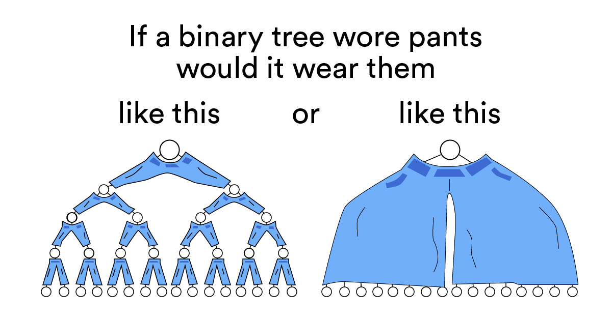

# GuessTheNumber

A simple guess the number game! The computer chooses a random number between 1 and 100, then challenges the player to guess the number.

## Setup

_Read Level 00 A in the `LVL_00.md` file first!_

Just to get you started coding as quick as possible, use the online editor CodePen for your first game! For the next game you'll learn how to setup your own computer for development.

Create an account on Github:

<https://github.com/>

Then create an account on CodePen, sign up with GitHub:

<https://codepen.io>

Open this pen and press "Fork" in the bottom left menu bar:

<https://codepen.io/qashto/pen/porNBjX?editors=0010>

## Instructions for Part A

Since you're just starting to write this program, don't make the number random yet so you can test it out more easily. Create a variable called `num` using `let` and assign it the number that the player will try to guess.

Tell the player to guess a number using `await prompt()` put your message (String) inside the parenthesis of the `prompt` function. Create the variable `guess` using `let`, assign it to the user's response to the `prompt`.

[Now you can click here to move onto Level 00 B](https://github.com/quinton-ashley/IntroToJS/blob/main/Level_00/LVL_00.md#level-00-b).

## Instructions for Part B

_Read Level 00 B in the `LVL_00.md` file before doing this section_

After each guess, the player should be told whether their guess was too high, too low, or if they guessed the number correctly! Use the `alert` function inside the code blocks `{}` of `if` and `else if` statements!

## Instructions for Part C

Make the game loop by using a while loop! Think about what condition must remain true for the player to keep playing the game.

## Instructions for Part D

Use the `random` function to enable your computer pick a random number between 1 and 100 for the player to guess. Use the `Math.round` function to round the random number to the nearest whole number. To test your code, try using an `alert` to display the number your computer picks. When you are sure it is working, remove the `alert`.

Try playing your Guess the Number game a few times to make sure your code works. What do you think is the best way to play this game in order to guess the number in the fewest amount of guesses? (besides just being very lucky of course haha)

Congrats! You finished your first game in JavaScript.

Level up to level 01!

---

## CHALLENGE SECTION

_Complete the Level 04 game, Hangman, first!_

If you haven't already, figure out the best strategy to use when playing this game.

In this section you'll learn how to calculate the maximum amount of guesses required for players to correctly guess a number between 1 and 100. You'll limit the player to only be able to make that amount of guesses.

In this game the best strategy for the player is to perform a binary search. If the number was between 1 to 7 it should only take a maximum of 3 attempts to guess the number.

Using the binary search method, on attempt 1 the player should always guess 4, the midpoint of 1 to 7. Then if their guess was too low, they should guess 6, the midpoint between 4 and 7. Then if their guess was too high, they should guess 5.

If you make a diagram of all the possible numbers and decisions using this binary search method, you would create a binary search tree. Each branch of the tree is a choice the player takes, based on if their guess was too high or low. Each possible guess is a node in the tree.

```txt
guess 1:     4      2^0 = 1 node (root of the tree)
            / \     branches
guess 2:   2   6    2^1 = 2 nodes
          / \ / \   branches
guess 3:  1 3 5 7   2^2 = 4 nodes (leaves of the tree)
```

2^3 = 8 which is higher than 7 possible values the number could be, so only 3 attempts are required to guess the number in the range of 1 to 7 if the player uses the binary search method. All the numbers 1 to 7, are contained in the tree.

If the player had to guess between 1 to 10, sometimes it would take more than 3 attempts to guess it correctly. 2^4 is 16, so no more than 4 attempts are needed to guess a number between 1 to 10.

Now that you know how the binary search method works it should be easy to figure out how many guesses are required to guess any number between 1 to 100.

Create a variable `turn` for counting how many guesses the player has made. Tell the player they lost if they make more than the required amount of attempts to guess the number.

If the user enters a number outside the range of 1 to 100, tell them "Invalid guess" but don't count it against them. They should still have the same amount of valid guess attempts no matter how many invalid guess attempts they make.

Ask the user if they want to play again. If they say yes, reset the game. If they say no, tell them goodbye and end the game.

Here's the real question though...



When you're done move on to Level 05!
