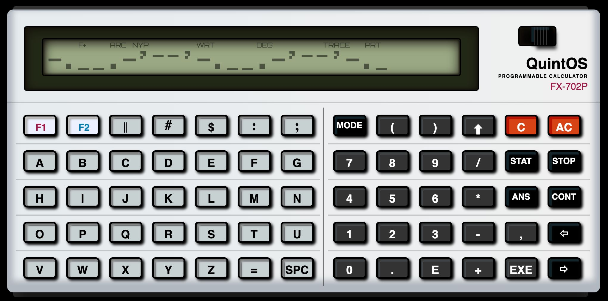
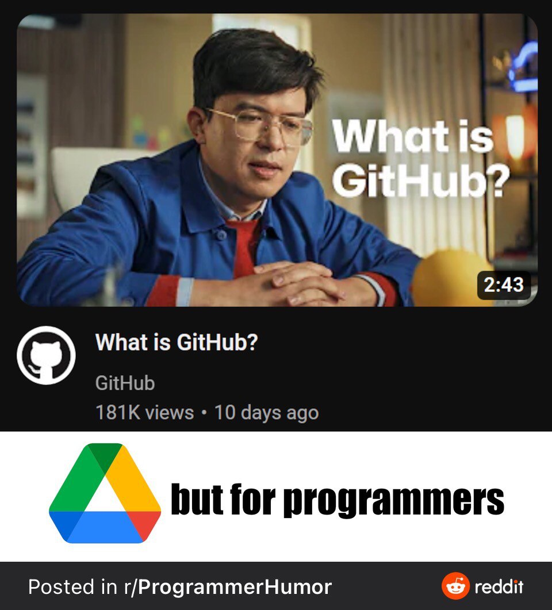
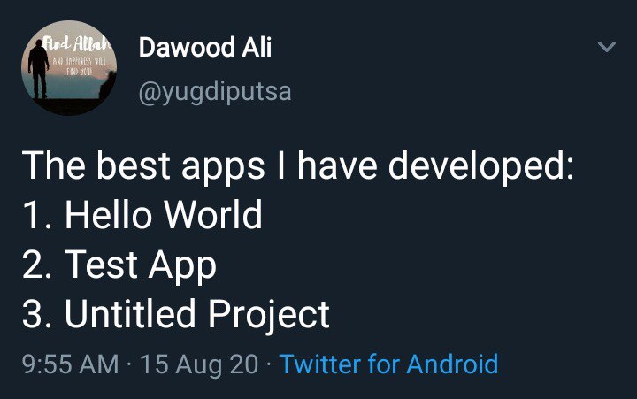

---
# Level 00 A
---

## What is Computer Science? 💻👨‍🔬

Why is this field of study called "Computer Science" and not "Program Writing" or "Code Mathematics"? It's because coding requires research and experimentation! You'll often need to test your programs to learn from unexpected errors, and then make changes to get the results you want.

---

These lessons will teach you how to code in JavaScript (JS), which is the most popular modern programming language and my personal favorite!

1 out of every 3 programming jobs (31%) require JavaScript skills. 👀

You'll need to memorize some vocabulary, grammar, and syntax to learn this new language. However, learning to code isn't what programming is all about, you'll also learn how to think like a programmer.

---

## What is QuintOS? 👾

If you signed up for this course you might want to know how video games work and how to make your own! If not, making games will hopefully be a fun way for you to learn how to code.

Issac Newton, a famous 17th century scientist, once said, "we stand on the shoulders of giants". Newton was humbly acknowledging that great advancements made by people in his day were built upon a giant foundation laid by our ancestors. To become a software developer today it's good to learn a bit about the history of computers and computer games.

---

QuintOS contains a set of retro computer simulations that I created for this course just to make writing your beginner level programs more fun. During each lesson you'll develop a game that runs on a virtual computer displayed in the Google Chrome web browser. As you level up your coding skills, the virtual computer will get upgraded too. Since you're just starting out, the first game you make will be for... a programmable calculator. 😜



---

This first lesson will require you to learn a lot of information before we can even make a simple game. It may be a bit overwhelming for you but don't worry! You'll get a lot of practice with these concepts so that you will fully understand them. Let's get started! 🥳

---

## Creating Variables 🔡

First of all, what is a variable? Variables in JavaScript store data in your computer's memory.

```js
let a = 0;
```

Use `let` to create variables. In the example code `a` is the name of the variable. `a` is assigned the number `0`.

Semicolons `;` can be used to end each line of code but they're not required. 👁👅👁

---

## Types of Data 💾

In JavaScript all variables can be created using `let`, regardless of the type of data they store.

---

### Number 🔢

Numbers in JavaScript can be positive, negative, or decimal.

```js
let x = 2;
let y = -49;
let z = 9504.15;
```

---

### Boolean ✅

Booleans can either be `true` or `false`

```js
let codingIsFun = true;
```

---

### String 💬

Strings are text, contained within 'apostrophes' or "quotes".

```js
let story = 'I took my dog to the dog park on 3rd Avenue.';
```

ERROR! If you don't use quotes, JavaScript will think the words are variables!

```js
let story = I took my dog to the dog park on 3rd Avenue.;
```

To remember that the data type for text is called String, you can think of lettered beads on a charm bracelet string.

---

### functions ⚙️

functions are a reference to other sections of code which you can run using `()` parenthesis. Input parameters to a function go in the parenthesis.

```js
powerOn();
turn('left');
moveForward(10);
turn('right');
moveForward(2);
```

This code for a robot remote control makes the robot power on, turn left, move forward ten steps, turn right, and then move forward two steps. Note that functions can do different things depending on their input values!

---

## Camel Case 🐫

Variable names in JS can't have spaces, 🙅‍♂️ so for variables that have multiple words, use camel case! Capitalize the first letter of the words after the first word.

```js
let apple = '🍎';
let applePie = '🍎 π';
let applePieIceCream = '🍎 π 🍨';
```

Note that using this naming convention isn't required for JavaScript to run, it's just something that most professional JS programmers do to make variable names easier to read. Camel case is a naming convention specific to JS, other programming languages have their own conventions.

---

## Globals 🌐

Globals are special variables that are available for you to use anywhere in your code.

## await 🛑

The `await` keyword is used in JavaScript to make certain parts of your code "wait" until something happens. This can be useful when you're working with things that take time to complete, like fetching data from a server or waiting for a user to click a button or type a response.

## alert and prompt ❔

Check out the `alert` and `prompt` global functions for user interaction.

The `prompt` function is used to ask the user for input, such as an answer to a question. The `alert` function is used to show the user a message.

```js
let favColor = await prompt('What is your favorite color?');
// the user's response to the prompt is assigned to favColor

await alert(favColor + ' is my favorite color too!');
```

In this example the program will wait for the user to type their favorite color and press enter before continuing. Then it will show an alert window with a message in which the program will always agree with the user's choice of favorite color.

---

## Comments 📝

Double slash `//` is for making a comment, any text behind it on the same line will not be considered part of the code's instructions. Comments are used to describe what is happening in the code. You might want to make comments so other people can understand your programs or so that you can understand it yourself in case you forget what you did.

---

## End of Level 00 A

Now you're ready to start making your first game! 🥳 [Click here for the GuessTheNumber instructions.](https://github.com/quinton-ashley/IntroToJS/blob/main/Level_00/GuessTheNumber.md)



---

# Level 00 B

Did you complete `GuessTheNumber` part A and are ready to learn more? Before we can finish the game we have to learn a bit more stuff.

---

## Checking Equivalence ✅

Single equals `=` is for assigning values to variables. Double equals `==` is a boolean operator used for checking equivalence. What is a boolean operator? It performs an operation that results in either a true or false (boolean) value.

---

## if/else statements

`if` statements use a boolean condition, which goes in parenthesis after the keyword `if`. If the boolean condition is `true`, the code block `{}`, whatever's inside the squiggly brackets, is run.

---

Check out this coin toss example code. Coin tosses are used in many sports to decide which of two teams goes first. One team picks which side of the coin they think will land facing up, "heads" or "tails". If the result of a coin flip is "heads" then the code in the `if` statement code block will be run. If the result was "tails", then the code in the `else` block is run.

```js
let pick = await prompt('Heads or Tails?');

if (coinFlip() == pick) {
	await alert('Heads wins the coin toss!');
} else {
	await alert('Tails wins the coin toss!');
}
```

---

## else if chaining

`else if` can be used after if statements, they form a chain of different paths the code can take if the previous if statements were false.

---

Take a look at the example below, which assigns a color to the variable `fruitColor` based on the name of the `fruit`.

```js
let fruit = await prompt("What's your favorite fruit?");
let fruitColor; // variables can be created without a value assigned to them

// if the fruit is a banana
if (fruit == 'banana') {
	// set the fruitColor to yellow
	fruitColor = 'yellow';
} else if (fruit == 'pear') {
	// else if the fruit is a pear, set the fruitColor to green
	fruitColor = 'green';
} else if (fruit == 'orange') {
	fruitColor = 'orange';
} else if (fruit == 'grape') {
	fruitColor = 'purple';
} else {
	// else the fruit was not a banana, pear, orange, or grape
	// the fruitColor is unknown
	fruitColor = 'unknown';
}

await alert('The color of a ' + fruit + ' is ' + fruitColor);
```

What color will be assigned to `fruitColor` if the `fruit` is a pear? What if the fruit is a strawberry?

---

## Boolean operators 🐰

```txt
Equivalence:              ==
Not equals:               !=
Less than:                <
Less than or equal to:    <=
Greater than:             >
Greater than or equal to: >=
```

Boolean operations evaluate to either true or false. Use them in the boolean conditions (inside the parenthesis) of `if` and `else if` statements.

---

# Level 00 C

---

## Changing a variable's value

Don't create variables twice!

```js
let x = 10;
let x = 5; // ERROR! x already exists
```

Here's how to change the value of the variable `x`

```js
let x = 10;
x = 5; // good :)
```

---

## Code Execution Order

Note that you can not use a variable before you create it. You will get an error saying the variable is not defined, meaning that JS doesn't have a variable with that name in its memory.

```js
await alert(message); // ERROR: message is not defined
let message = 'Hi!';
```

Create variables before you use them.

```js
let message = 'Hi!';
await alert(message); // good!
```

---

## Scopes

Note that if you declare a variable in a code block it will only be available from the beginning to the end of the block. This is called the scope of a variable. The code block/scope begins with this opening squiggly bracket (aka curly brace) `{` and ends with a closing squiggly bracket `}`

```js
if (name == 'Bob') {
	let message = 'Hi Bob!';
}

await alert(message); // ERROR: message is not defined
```

---

Fix this by initializing `message` outside of the if statement.

```js
let message;
if (name == 'Bob') {
	message = 'Hi Bob!';
}

await alert(message); // good!
```

---

Also remember to finish every scope you start! Every opening brace `{` needs a closing brace `}`.


---

## while loops

Need to loop some code? Use a while loop! `if` statements run the code in their code block once if their boolean condition is true. `while` loops repeat the code in their code block as long as their boolean condition _remains_ true.

Take a look at the following example. Imagine that the `pickACard` function returns a String with the name of the card taken from the top of the deck, such as "Two of Hearts" or "Nine of Clubs".

```js
let card; // no card picked yet

while (card != 'Ace of Spades') {
	card = pickACard();
}

await alert('Found the Ace of Spades!');
```

---

# Level 00 D

---

## Mathematical operators 🔢

```txt
Addition:       +
Subtraction:    -
Multiplication: *
Division:       /
```

The multiplication symbol is the asterisk, NOT the letter `x`!

```js
let x = 5 * 8; // x -> 40
```

---

## Math: Generate a random number

```js
// random(low, high) returns a random decimal number in the specified range
let x = random(0, 1); // numbers ranging from 0 to 1
let x2 = random(-4, 7); // numbers ranging from -4 to 7
```

---

## Math: round

The `round` function rounds a number to the nearest integer.

```js
let y = round(5.3); // y -> 5
```

---

# End of Level 00

When you're done with your GuessTheNumber game you'll have already made something much cooler than the usual beginner CS project!



---

## Computer History: Casio FX-720P

This level's computer was inspired by the Casio FX-720P, which could run programs in a programming language called BASIC. Portable programmable calculators were limited by their small button keyboards and displays, but when slotted into a dock that had little printer, they could be used to print out graphs and many lines of text. The calculator could also load programs from tape cassettes.

<https://youtu.be/d3NIe1jTZMc?t=760>

---
