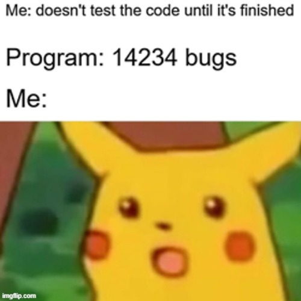
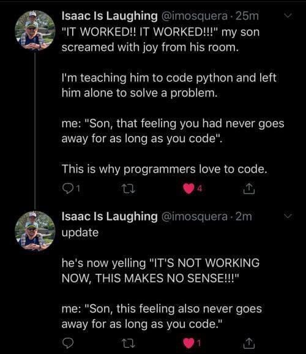

---
# Level 01 A
---

Congratulations, you completed level 0! 🥳

Before you start your next game, let's get you setup for JavaScript development on your own computer so you won't have to use CodePen, which is an online-only code editor.

---

## Requirements for Local JS Development

- install Google Chrome (Firefox, Edge, and Opera are good too, but not Safari)
- install [node.js](https://nodejs.org/en/) (includes [npm](https://www.npmjs.com/))
- Windows users need to install [Git](https://gitforwindows.org/)
- macOS users need to use the command `xcode-select --install` in the Terminal app
- install the [Visual Studio Code editor](https://code.visualstudio.com/)

---

## Setup

Open the [quintos-template](https://github.com/quinton-ashley/quintos-template) project on Github. Press the big green button that says "Use this template". Name your project "quintos-games".

---

Now open the Git Bash app on Windows or the Terminal app on macOS and copy/paste these commands. Replace `!!!your username!!!` with your GitHub username.

```sh
cd ~/Documents
git clone https://github.com/quinton-ashley/IntroToJS.git
git clone https://github.com/!!!your username!!!/quintos-games.git
cd quintos-games
npm i
```

Don't worry I'm not hacking your computer! The first command `cd`, changes directory (aka folder), which opens your Documents folder inside the terminal (you can choose a different folder if you'd like). The second command downloads my teaching curriculum "IntroToJs". The third command downloads your "quintos-games" project. The fourth command changes directory into your "quintos-games" folder. The last command, `npm i`, installs "QuintOS".

Open Visual Studio Code (aka VSCode) and add "IntroToJS" and your "quintos-games" folder to the workspace.

---

## Install Extensions for VSCode

In the Activity Bar on the left side of VSCode click the extension icon, which looks like one box being separated from three other boxes, you can search for the following extensions or use the links below to install them.

---

"Live Server" auto-refreshes the browser when you make changes to your code.
<https://marketplace.visualstudio.com/items?itemName=ritwickdey.LiveServer>

---

"Prettier" is an extension that will automatically format your code for you when you save it so you won't have to worry about doing proper indentation and formatting yourself!
<https://marketplace.visualstudio.com/items?itemName=esbenp.prettier-vscode>

---

"Markdown Preview Enhanced" is a great extension for previewing Markdown files (the kind of file you're reading right now).
<https://marketplace.visualstudio.com/items?itemName=shd101wyy.markdown-preview-enhanced>

---

"vscode-color-picker" is a great extension for picking colors in JavaScript files.
<https://marketplace.visualstudio.com/items?itemName=AntiAntiSepticeye.vscode-color-picker>

---

## VSCode Settings

Press F1 on your keyboard (hold Fn then press F1 on macOS). Search the menu for "Preferences: Open Settings (JSON)". Use these settings in VSCode's `settings.json` file:

```json
"editor.defaultFormatter": "esbenp.prettier-vscode",
"editor.guides.bracketPairs": true,
"editor.bracketPairColorization.enabled": true,
"editor.formatOnPaste": true,
"editor.minimap.enabled": false,
"editor.tabSize": 2,
"editor.insertSpaces": false,
"editor.formatOnSave": true,
"editor.wordWrap": "on",
"explorer.confirmDelete": false,
"explorer.confirmDragAndDrop": false,
"files.insertFinalNewline": true,
"files.trimFinalNewlines": true,
"prettier.jsxSingleQuote": true,
"prettier.singleQuote": true,
"prettier.trailingComma": "none",
"prettier.useTabs": true,
"prettier.printWidth": 120,
"diffEditor.wordWrap": "on",
"liveServer.settings.donotShowInfoMsg": true,
"editor.glyphMargin": false,
"editor.folding": false
```

---

## Loading QuintOS Games

Copy your GuessTheNumber code from CodePen and put it in `GAMES/GuessTheNumber/guessTheNumber.js`

Edit the `load.js` in your `quintos-games` project folder. Set `QuintOS.user` to your GitHub username.

```js
QuintOS.user = 'your username';
QuintOS.dir = 'GAMES';
QuintOS.game = 'GuessTheNumber';
```

In VSCode, right click on the `index.html` file and select `Open with Live Server` or click `Go Live` on the bottom status bar. You should see the calculator show up in your browser. 😄


---

You've finished the install process! Read the next lesson section before starting the Pick A Path project.

---

## Special characters

When you make Strings using quotes they can't be on multiple lines of your JavaScript file.

```js
let example = "I want to put something on a new line:
something"; // ERROR!
```

---

To put part of a String on a newline use the newline character: `\n`

```js
let example = 'I want to put something on a new line:\nsomething';
```

Result:

```txt
I want to put something on a new line:
something
```

---

The tab character `\t` is for indenting text.

```js
let list = 'Grocery list:\n\n\tApples\n\tOranges\n\tBananas';
```

```txt
Grocery list:

	Apples
	Oranges
	Bananas
```

---

## Adding Strings

You can add Strings together using the `+` operator.

```js
let firstName = 'Quinton';
let lastName = 'Ashley';
let fullName = firstName + ' ' + lastName;

console.log(fullName); // -> 'Quinton Ashley'
```

---

## Javascript Console

Code is essentially a set of instructions for your computer to interpret and perform. If you make syntax and spelling mistakes in your code, your computer won't know what to do! Luckily for us, web browsers have really great development tools to help us fix mistakes in our code.

The console can be opened in your web browser by right clicking anywhere on a web page and choosing "Inspect" or by using the shortcut `ctrl+shift+i` on Windows/Linux or `cmd+option+i` on macOS. When it first opens you'll see the "Elements" tab, this is the HTML structure of the website. If you hover your mouse over an element it will be highlighted. You can even change text on the website. Cool huh?! Note that these changes are only visible to you.

---

Now go to the "Console" tab. If your program doesn't start or stops working, look at the JavaScript console for errors. You can also use `console.log` to print things to the console.

With QuintOS you can use the shortcut `log` for `console.log`.

```js
log("The user's favorite color is: " + favColor);
```



---

## End of Level 01 A

Start your PickAPath game! Follow the instructions in project file `PickAPath.md` located in the same folder as this lesson file.

---

# Level 01 B

---

## Boolean Operators

Boolean operations result in either a `true` or `false` value.

---

### NOT (aka negation)

```txt
!x is true if x false

Truth Table (0 means false, 1 means true)
x
0 = 1
1 = 0
```

---

### OR

```txt
(x || y) true if x or y is true
Checking x first, then y if x is false.

Truth Table
x y
0 0 = 0
1 0 = 1
0 1 = 1
1 1 = 1
```

---

### NOR

```txt
!(x || y) true if both x and y are false

Truth Table
x y
0 0 = 1
1 0 = 0
0 1 = 0
1 1 = 0
```

---

### AND

```txt
x && y true if x and y are true

Truth Table
x y
0 0 = 0
1 0 = 0
0 1 = 0
1 1 = 1
```

---

### NAND

```txt
!(x && y) true if any are false

Truth Table
x y
0 0 = 1
1 0 = 1
0 1 = 1
1 1 = 0
```

---

## Compound Operations

Try it out! What is the solution to this truth table?

```txt
(x || y) && z; // true if x or y is true and z is true
// truth table
x y z
0 0 0 =
1 0 0 =
0 1 0 =
0 0 1 =
1 1 0 =
1 0 1 =
0 1 1 =
1 1 1 =
```

---

# Level 01 C

---

## Arrays

[Arrays](https://developer.mozilla.org/en-US/docs/Web/JavaScript/Reference/Global_Objects/Array) are lists of variables.

```js
let names = ['Amy', 'Ellie', 'Max'];
let nums = [50, 21, 46, 83];
```

---

## Array length

length is a property of Array accessed using a period `.`

```js
log('The names array has ' + names.length + ' names');
```

This example code would print "The names array has 3 names" to the console.

---

## array.includes(item)

One useful function you can use on Arrays is `includes`, it checks if an item is included in the array.

```js
// Ellie is included in the array of names...
if (names.includes('Ellie')) {
	// ... so the code in this block is run
}

// James is not included in the array of names...
if (names.includes('James')) {
	// ...so the code in this block is skipped
}
```

---

## Redefining an Array

Arrays can be redefined by changing their value after they are created just like with other variables.

```js
// create the array using let
let luckyNumbers = [4, 8, 24];

// replace the lucky numbers with a different set of numbers
luckyNumbers = [6, 10, 32];
```

---

# End of Level 01



---

## Computer History: Commodore PET

This level's computer was inspired by the Commodore PET 2001 Series released way back in 1977. These computers were some of the first commercially successful personal computers that did not require any assembly by the user. Check out this video about it if you'd like!

<https://www.youtube.com/watch?v=eP9y_7it3ZM>

The Commodore PET 2001 was the first computer that Satoru Iwata, former president of Nintendo, owned while he was studying computer science at the Tokyo Institute of Technology. His days of programming on a programmable calculator were over. Satoru's dorm room became known as "Iwata's Arcade" among his classmates. At that time there were only 9 other people at his college that owned their own computer. His first game for the PET was called "Car Race".

---

Satoru went on to become a brilliant programmer at HAL Laboratories and worked on Kirby's DreamLand. At Nintendo he worked on Super Smash Bros. Melee (my favorite video game). You can learn more about his life by watching this video by Gaming Historian:

<https://www.youtube.com/watch?v=k4cJh2YgrKE>

PET computers are also famous for their fun character set (font) called PETSCII:

<https://style64.org/petscii/>

---
