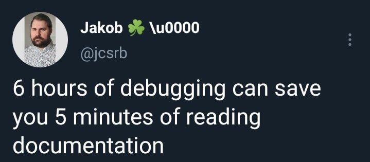

---
# Level 02 A
---

## Creating functions 👷

Create functions using the `function` keyword.

```js
// create the function
function sayHello() {
	log('hello!'); // prints "hello!" in the JS console
}

sayHello(); // run the function
```

The code inside a function isn't run when the function is created, only when it's invoked.

## Using Libraries 📚

As a programmer it's important to learn how to use libraries. And no... we're not talking about the kind of library you go to borrow books from!

Libraries, primarily referred to as packages in JS, are collections of code that other people have written.

The most popular JS packages provide solutions to common problems. Using libraries can prevent you from wasting time re-inventing the wheel! Although building something "from scratch" using only core features of a programming language can sometimes be a good educational experience or allow for greater customization. Yet, often it's easier to use a library.

---

## What is p5play and p5.js? 🌸

To make Pong we're going to use p5play, a 2D game engine made by Computer Science teachers to help you turn your game ideas into JavaScript code!

<https://p5play.org>

The lead developer of p5play is Quinton Ashley, a Computer Science teacher at Crimson Education who's also the author of these lessons!

---

## p5play Sprites

Take a look at page 0 and 1 of the Sprite learn pages on the p5play website.

<https://p5play.org/learn/sprite.html>

---

## spriteArt

The p5play `spriteArt` function can be used to create images very easily! The first parameter to `spriteArt` is a String representing the color values of pixels.

```js
let img = spriteArt('wgw');
```

This example code would create an image with one white pixel, followed by a green pixel, and then another white pixel.

---

Here's the limited color palette you can use for this game. They are the same colors as the real ZX Spectrum, which this level's computer is based on.

|   letter   |     color      |
| :--------: | :------------: |
| '.' or ' ' | transparent 🔳 |
|    'b'     |    Black ⬛    |
|    'u'     |    blUe 🟦     |
|    'r'     |     Red 🟥     |
|    'm'     |   Magenta 🔴   |
|    'g'     |    Green 🟩    |
|    'c'     |    Cyan 🔵     |
|    'y'     |   Yellow 🟨    |
|    'w'     |    White ⬜    |

---

## Make Strings with Back-ticks

Back-ticks can also be used to create Strings. Back-ticks look like a backwards apostrophe. They can be found on your keyboard on a special key next to the number 1. The back-tick key also has a squiggly line `~` called a tilde on it.

When back-ticks are used to create Strings, the text inside the back-ticks can go on multiple lines of code and retain these newlines without the use of the newline `\n` character.

---

Can you tell what the image is?

```js
let str = `
...yyyy
.yybyybyy
yyyyyyyyyy
yybyyyybyy
.yybbbbyy
...yyyy`;

let img = spriteArt(str);
```

---

It's a simple yellow and black smiley face image! 😃

---

## String.repeat(amount)

To more easily create large Strings you can use a String function called repeat.

<https://developer.mozilla.org/en-US/docs/Web/JavaScript/Reference/Global_Objects/String/repeat>

```js
let pattern = '><'.repeat(4);
// pattern -> '><><><><';
```

---

# Level 02 B

---

## p5play Input Devices

Take a look at page 0 of the Input learn pages on the p5play website.

<https://p5play.org/learn/input_devices.html>

---

## Sprite velocity vector

What is a velocity? A velocity is an object's speed along one axis of movement. In p5play a sprite's velocity vector is an object with two properties: `x` and `y`. These properties represent the sprite's speed along the x and y axes.

```js
sprite.velocity.x = 5;
```

---

# Level 02 C

---

## Drawing text to the screen

In QuintOS, text can be displayed at a specified row and column on the screen.

```js
// (text         , row, col)
txt('Hello World!', 10, 12);
```

Note that the (row, col) dimensions of the screen are different than its (x, y) pixel coordinates.

---

# Level 02 D

---

## Custom collision handling

In p5play it's easy to change what happens after two sprites collide using the `collided` function inside the p5.js draw function.

```js
if (laser.collided(shield)) {
	laser.direction = 20;
	laser.speed = 1;
}
```

In this example code, the laser gets deflected upward after hitting the shield.

---

## End of Level 02

Remember, don't "reinvent the wheel" if you don't have to!



---

## Computer History: ZX Spectrum

Excerpt from the last paragraph of Chapter 1 of "ZX81 BASIC PROGRAMMING" by Stephen Vickers:

"Whatever else you do, keep using the computer. If you have a question 'What does it do if I tell it such & such?' then the answer is easy:type it in & see. Whenever the manual tells you to type something in, always ask yourself, 'What could I type instead?' & try out your replies. The more of your own stuff you write, the better you will understand the ZX81. (This is called un-programmed learning.) Regardless of what you type in, you cannot damage the computer."

---

This level's computer is based on the ZX Spectrum, an 8-bit personal home computer developed by Sinclair Research. It was first released in the United Kingdom on the 23rd of April 1982 and went on to become Britain's best-selling microcomputer. Watch some of this video to hear what it was like for people to use the ZX Spectrum back then!

<https://youtu.be/nRlmTiynbd8?t=242>

---
