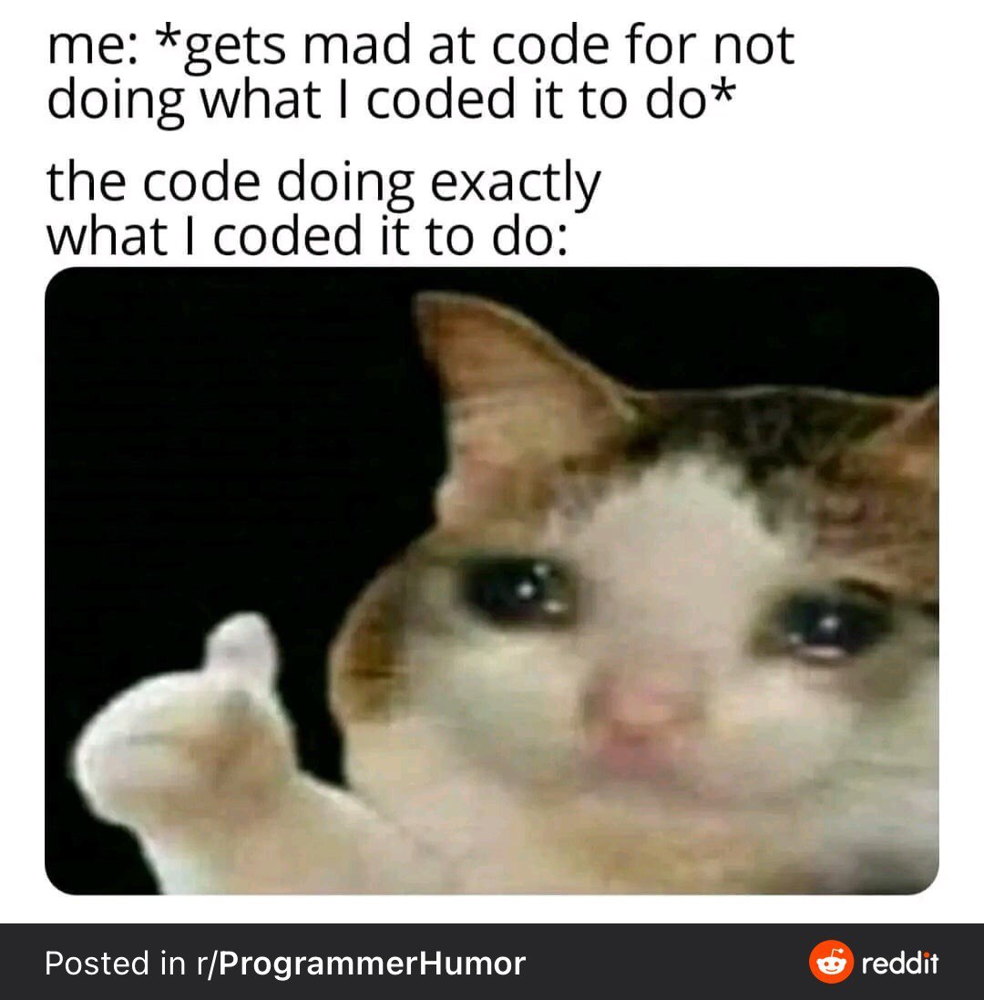

---
# Level 03 A
---

## Accessing items in an Array

Items in an array can be accessed using `[]`, referred to as "sub" or "at". For example, `names[0]` is referred to as names sub 0 or name at 0.

The first item in a JavaScript array is at index 0, the second item is at index 1, and so on.

```js
let names = ['Amy', 'Ellie', 'Max'];
let nums = [50, 21, 46, 83];

log(names[0]); // prints the String 'Amy' to the JS console
log(nums[1]); // prints the Number 21 to the JS console
```

---

## Counting with while loops

Here's an example of a while loop with a counter variable. The code in the while loop prints the numbers 0 through 9 to the JS console.

The variable name `i` stands for "index". It is the standard name for a counter variable.

```js
let i = 0; // initialize the counter variable

while (i < 10) {
	log(i);
	i++; // increment the counter variable
}
```

---

## p5play Groups

Take a look at the first page of the p5play Group reference pages:

<https://p5play.org/learn/group.html>

---

# Level 03 B

---

## for loops

Scroll up and take another look at the example of the while loop with a counter variable.

A `for` loop is a more convenient way to repeat a block of code a certain number of times.

---

Here's an example of a `for` loop in action:

```js
// (initialization; condition; increment)
for (let i = 0; i < 10; i++) {
	log(i);
}
```

In this example, the `for` loop does the following:

1. The `initialization` sets the counter variable `i` to 0.
2. The `condition` checks if `i` is less than 10. If it is, the code inside the loop gets run. If not, the loop ends.
3. The `increment` increases the value of `i` by 1 after each iteration of the loop.

---

The `for` loop will continue to execute until the condition evaluates to `false`, which will happen when `i` is equal to 10. At that point, the loop will be terminated and the code will continue to execute after the `for` loop.

In this example, the code inside the `for` loop simply prints the value of `i` to the console. This will result in the numbers 0 through 9 being printed to the console.

---

# Level 03 C

---

## Animation

Look at the Animation Learn page 0, 1, 2, and 3 on the p5play website:

<https://p5play.org/learn/sprite_animation.html>

---

# Level 03 D

---

## Loading sounds

The `loadSound` function loads a sound file from a given path. A path is the location of a file on your computer. Only use this function in the p5.js `preload` function!

Be sure to create the variable that will hold the sound object outside the `preload` function so that you can use the sound in any function.

```js
let greeting;

function preload() {
	greeting = loadSound('sounds/hi.mp3');
}
```

---

## Setting the playback volume

Volume ranges from 0 (no sound) to 1 (full volume). Usually you won't want any individual sound to play at full volume so that you can mix sounds at a typical listening volume without distortion.

```js
greeting.setVolume(0.3);
```

---

## Playing sounds

Play sound objects by using the play function.

```js
greeting.play();
```

---

# To be continued...

Come back to Level 03 E after you complete level 5.

---

## Computer History: Nintendo GameBoy

_Despite receiving mixed reviews by critics and being technologically inferior to its fourth-generation competitors (Sega's Game Gear, Atari's Lynx, and NEC's TurboExpress), the Game Boy received praise for its battery life and durability in its construction. It quickly outsold the competition, selling one million units in the United States within a few weeks. An estimated 118.69 million units of the Game Boy and its successor, the Game Boy Color, have been sold worldwide, making it the third best-selling video game console of all time. It is one of the most recognizable devices from the 1990s, becoming a cultural icon in the years following its release._

https://en.wikipedia.org/wiki/Game_Boy

---

# Level 03 E

Welcome back to level 3! You're now ready to start working on part E of the LilyLeap game.


---

## modulo operator

The modulo operator `%` it gets the remainder of a division.

```js
// true if x is even (divisible by 2)
if (x % 2 == 0) {
	log('x is even!');
}

// true if y is divisible by 5
if (y % 5 == 0) {
	log(y + ' is a multiple of 5');
}
```

---

# End of Level 03

Don't get too mad at your code! Taking a break and doing something else can give you a fresh perspective on your code.



---
