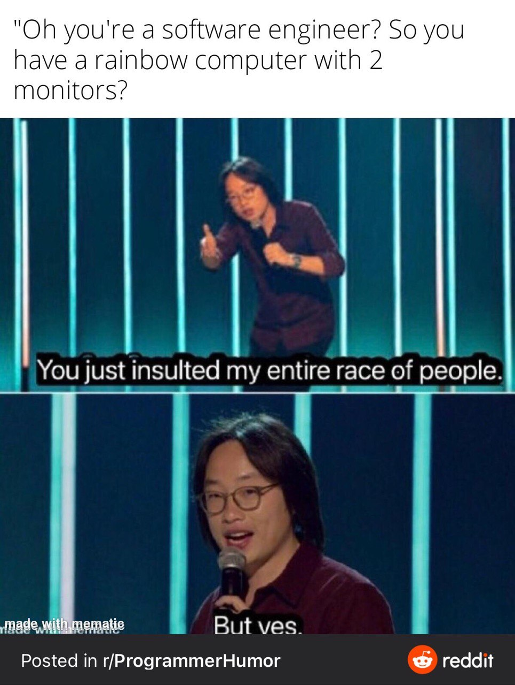

---
# Level 05 A
---

Do the GuessTheNumber challenge section before starting level 05!

---

## Coding Philosophy: Naming variables

Good code should be easy for other programmers (humans) to read and efficient for your computer to run. Here are some guidelines for how to write good code!

Above all, it's important to put effort into thinking of GOOD names for your variables. Good variable names in Javascript are short and concise descriptors.

---

## Create a Button

Buttons glow when hovered over and are clickable. The `button` function is quite similar to the `text` function.

```js
//    (text, row, col)
button('Yes', 5, 5);
button('No', 5, 9);
```

---

# Level 05 B

---

## Respond to button clicks

You can add a fourth input parameter to the button function, a callback function that gets run when the button is clicked.

```js
function test() {
	console.log('You clicked the button!');
}
//    (text,     row, col, function)
button('Click me!', 5, 5, test);
```

Note that the callback function is passed as a variable, it is not run using parenthesis `()` when the button is created. It gets run only when the button is clicked.

---

## Recursion

In the past few lessons you've learned about `for` loops and `while` loops. Recursion is another way to loop code. It is simply a function that calls itself inside its own definition.

```js
function doRecursion() {
	doRecursion(); // infinite loop! OH NO!
}
```

---

Here's a more practical example of a recursion loop that ends when the player loses all their health points. Although for such a simple case of recursion it'd be more efficient to use a while loop.

```js
let health = 100; // initial health

function gameLoop() {
	//
	// ... game code here ...
	//
	if (health > 0) {
		gameLoop();
	} else {
		gameOver();
	}
}
```

---

# Level 05 C

---

## Change the position of prompts and alerts

The position of prompt and alert windows can be changed by defining their row and column values just like with the `text` and `button` functions. You can also limit the width of the window.

```js
//         (text           , row, col, width limit)
await alert('I can move too!', 5, 12, 20);
```

---

## asynchronous functions

To use `await` inside a function you must make it an `async` function.

```js
async function sayHello() {
	let name = await prompt("What's your name?");
	await alert('Hello ' + name + '!');
}
```

---

## async/await vs callbacks

`async`/`await` and callbacks are the two main forms of asynchronous programming in JavaScript. `async`/`await` was added to JavaScript in 2017 so that asynchronous code could be written linearly, like synchronous code, one line after the other.

Callbacks are non-linear, so they are good for handling events (like button clicks) that in some cases we wouldn't want our program to wait for. For example if you gave the user a choice between clicking a "Yes" or "No" button you wouldn't want the program to wait for them to click "Yes" because they might click "No". A separate callback function is needed to handle each response.

---

# Level 05 D

---

## Date.now()

`Date.now()` returns the current date in milliseconds since the UNIX epoch which occurred at the start of midnight on the 1st of January 1970.

Over 1.6 trillion milliseconds have occurred since then!

## performance.now()

`performance.now()` returns the number of milliseconds since the start of the program.

It's more accurate than `Date.now()` because the accuracy of `Date.now()` is limited by the browser to prevent hackers from pulling off timing attacks.

---

# Level 05 E

---

## += operator

The `+=` operator can be used to add to the existing value of a variable.

```js
let story = 'The cow';
story += ' jumped over the moon.';
// story -> "The cow jumped over the moon"
```

---

You can use `+=` with numbers too!

```js
let x = 5;
x += 2; // shortcut for x = x + 2
console.log(x); // x -> 7
```

`-=`, `*=`, and `/=` operators can also be used with numbers.

---

# Level 05 F

---

## modulo alternation

Here's how modulo can be used for alternation.

```js
for (let i = 0; i < 10; i++) {
	if (i % 2 == 0) {
		txt('even', i);
	} else {
		txt('odd', i);
	}
}
```

---

## for loops with non-standard incrementation

This code does the same kind of alternation.

```js
for (let i = 0; i < 10; i += 2) {
	txt('even', i);
	txt('odd', i + 1);
}
```

---

# End of Level 05

Congrats! You're halfway through the Intro to JavaScript course! You've learned a lot about programming. 🥳



---

## Computer History: GRiD Compass

This level's computer is based on the GRiD Compass 1101. The following description is from http://oldcomputers.net/grid1101.html


Designed to be the ultimate portable computer, the clamshell-style GRiD Compass 1101 is the grand-daddy of all present-day laptop computers.

---

The Compass was very high-tech, with its flat-black, die-cast magnesium-alloy case, and bright, sharp electroluminescent display (ELD). No other system packed so much speed and power in as small a case, and none had such a unique and large, easy-to-read screen, allowing full 80x24 text.

Of course, all of these great features raised the price significantly. At $8150, the GRiD Compass 1101 was the most expensive personal computer on the market.

Originally developed for business executives, GRiDs were also used by the U.S. military 'in the field', and by NASA on the Space Shuttles during the 1980's and 90's. It's even been said that the US President's "nuclear football" at one time included a GRiD computer.

---
