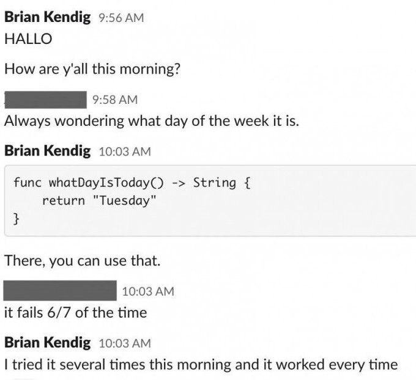
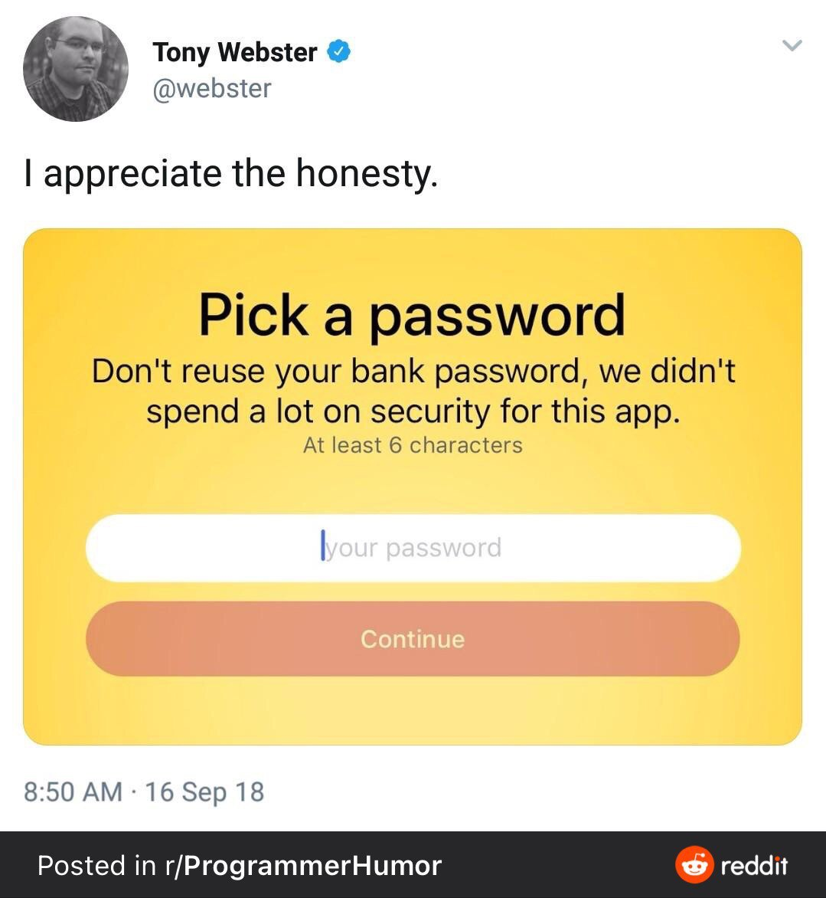

---
# Level 08 A
---

## Encryption

Encryption is a way of converting information into a secret code so that only people who have the right "key" can read it.

Imagine you have a secret message that you want to send to a friend. You could write the message on a piece of paper and give it to them, but someone else might see it and read the message. To keep the message secret, you could use encryption.

---

To encrypt the message, you would use a special formula or algorithm to turn the message into a secret code. This code would be very difficult for anyone else to understand without the key. Then, you could send the encrypted message to your friend.

When your friend receives the message, they would use the key to decrypt the message and turn it back into the original message. This way, only your friend would be able to read the message, even if someone else intercepted it.

Encryption is used to keep important information secure, such as passwords, financial data, and confidential messages. It is an important tool for protecting information online and in other forms of communication.

## Caesar Cipher

In cryptography, a Caesar cipher, also known a shift cipher, is one of the simplest and most widely known encryption techniques. The method is named after Julius Caesar, who used it in his private correspondence.

It is a type of substitution cipher in which each letter in the original text is replaced by a letter some fixed number of positions down the alphabet.


---

Let's take a look at a right shift (positive shift) of 1, which means if "A" occurs in the original message it would be shifted one letter position to "B" in the encrypted message.

// prettier ignore
| Alphabet | A | B | C | D | E | F | G | H | I | J | K | L | M | N | O | P | Q | R | S | T | U | V | W | X | Y | Z |
|----------|---|---|---|---|---|---|---|---|---|---|---|---|---|---|---|---|---|---|---|---|---|---|---|---|---|---|
| ~Shifted | B | C | D | E | F | G | H | I | J | K | L | M | N | O | P | Q | R | S | T | U | V | W | X | Y | Z | A |

Here's an example of Caesar Cipher encryption:

```txt
Original Message:  HELLO WORLD!
Encrypted Message: IFMMP XPSME!
```

## String toUpperCase and toLowerCase

```js
let str = 'Hello!';
let up = str.toUpperCase(); // up -> 'HELLO!'
let low = str.toLowerCase(); // low -> 'hello!'
```

Note! These functions do not change the original value of the string.

---

## Breaking out of a loop

Use the keyword `break` to break out of a loop.

```js
while (playerHealth > 0) {
	// ... game loop code

	if (gameOver) {
		await alert('Game Over!');
		break;
	}
}
```

---

## string.indexOf

The `indexOf` function returns the index of the first occurrence of a specified value in a string. If the value is not found, it returns -1.

```js
let str = 'Hello World!';
let index = str.indexOf('o'); // index -> 4
```

---

## End of Level 08 A

What's the funny mistake this user made when testing their code? Remember to test your programs thoroughly!



---

# Level 08 B

---

## Load a text file

```js
let filePath = QuintOS.dir + '/art.txt';
let data = await fetch(filePath);
let textContent = await data.text();
```

`QuintOS.dir` stores the file path to your game directory.

`fetch` loads file data asynchronously and returns a `Response` object. If the response contains text then it can be converted to a string using the Response `.text()` async function.

---

# Level 08 C

---

## Coding Philosophy: Using functions effectively

Try not to rewrite the same lines of code in different places, put that code in a function instead.

If you have a chunk of code and you need to do something only slightly different at another point in your program, sometimes you should make a function with input parameters for the thing(s) that are different. Typically functions should only contain code that is related to the name/description you gave that function, move unrelated code into its own function.

---

## String slice

The String `slice()` function is used to extract a part of a string and return it as a new string. It accepts two input parameters: a start index and an end index. The extracted part of the string includes the characters from the start index up to, but not including, the end index.

```js
let str = 'Hello World';

// Extract the characters from the start index up to, but not including, the end index
let sliced = str.slice(3, 7);

log(sliced); // -> "lo W"
```

The `slice` function doesn't change the string it's used on, it just returns a new string as a result.

---

If no end index is provided the sliced part of the string will contain all the characters in the original string after the start index.

```js
let str = 'Hello World';

// Extract the characters from the start index to the end of the string
let sliced = str.slice(3);

log(sliced); // -> "lo World"
```

---

You can also use negative indices with `slice()`. If you provide a negative index as the start or end argument, the index is calculated relative to the end of the string.

```js
let str = 'Hello World';

// Extract the last five characters of the string
let sliced = str.slice(-5);

log(sliced); // -> "World"
```

---

## Anonymous arrow functions

Arrow/lambda functions are a short way to write functions in JavaScript using an arrow `=>` instead of the word function. You can create arrow functions without naming the function too: `() => {}`

```js
button('click here!', 10, 4, () => {
	log('button clicked');
});
```

---

# End of Level 08

If you'd like to learn more about modern day encryption techniques, check out this video:

"How Quantum Computers Break The Internet... Starting Now" by Veritasium
https://www.youtube.com/watch?v=-UrdExQW0cs



---
