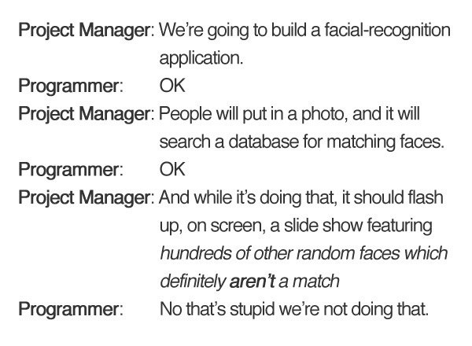

---
# Level 10 A
---

## Creating Objects

Objects have properties, aka key/value pairs. You've already used some properties that these objects have such as `.length` for Strings.

Let's take a look at how we could use an object to store attributes about Gumball, a character from the Cartoon Network show The Amazing World of Gumball.

```js
let gumball = {
	name: ['Gumball', 'Tristopher', 'Watterson'],
	species: 'cat',
	age: 12,
	grade: 7,
	studentID: '000029083',
	teacher: 'Ms. Simian'
};
```

---

Properties can be accessed using the dot syntax or with the `[]` square brackets.

```js
gumball.age; // -> 12
gumball['age']; // same thing

let prop = 'age';
gumball[prop]; // same thing

// accessing items in an array iniside an object
gumball.name[2]; // -> 'Watterson'

// editing the animal for property 'c'
gumball.grade = 8;
// adding new content to the object
gumball.brother = 'Darwin';
```

---

What does the `gumball` object look like after these changes?

```js
let gumball = {
	name: ['Gumball', 'Tristopher', 'Watterson'],
	species: 'cat',
	age: 12,
	grade: 8,
	studentID: '000029083',
	teacher: 'Ms. Simian',
	brother: 'Darwin'
};
```

---

## JSON file

JSON stands for JavaScript Object Notation. It is a way to store data in a text file. It is a common way to store data for web applications.

```json
{
	"apples": 2,
	"bananas": 10,
	"pears": 4
}
```

JSON files can also store an array containing multiple objects.

```json
[
	{
		"name": "Jake",
		"age": 12
	},
	{
		"name": "Ali",
		"age": 13
	},
	{
		"name": "Max",
		"age": 14
	}
]
```

---

## End of Level 10 A


---

# Level 10 B

---

## Loading a JSON file

```js
let filePath = QuintOS.dir + '/groceries.json';
let data = await fetch(filePath);
let obj = await data.json();
```

---

## for of loops

`for of` loops iterate through the values of an array.

```js
let names = ['Jake', 'Ali', 'Max'];
for (let name of names) {
	console.log('Hello ' + name);
}
```

Result:

```txt
Hello Jake
Hello Ali
Hello Max
```

---

## padEnd

This function adds characters to the end of a string until it reaches the specified length.

```js
let str = 'hello';
str = str.padEnd(10, 'x');
console.log(str); // str -> 'helloxxxxx'
```

---

# Level 10 C

---

## for in loops

`for in` loop iterates through the indexes/keys of an array or object.

```js
let list = {
	apples: 2,
	bananas: 10,
	pears: 4
};
for (let item in list) {
	console.log('I need to get ' + list[item] + ' ' + item + '!');
}
```

Result:

```txt
I need to get 2 apples!
I need to get 10 bananas!
I need to get 4 pears!
```

---

# End of Level 10



---
